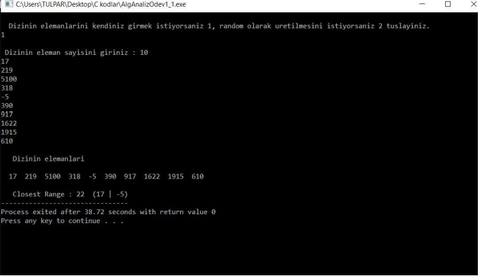
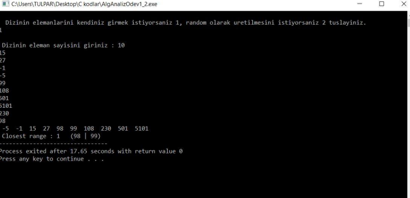
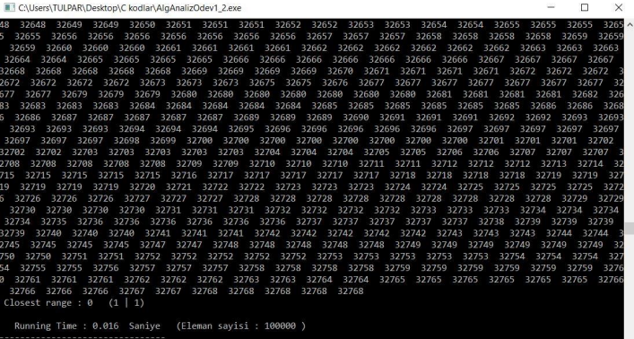

# Finding the closest 2 values (N-array)

> Analysis of Algorithm Assignment-1 (3rd year of University)

# Assignment Part 1

In this assignment, the closest 2 values were found using 2 different methods.

- **a) Brute Force :** What is [Brute Force](https://www.javatpoint.com/brute-force-approach)? To found closest 2 values with Brute Force search in N-array. Code [here](https://github.com/uguraltindal/Finding-the-closest-2-values-N-array-/blob/main/bruteforce.c).

- **b) 2nd-way :** Sort array with complexity **MergeSort(n logn)** at first. The reason we sort the array is, if the array elements are in order, it means that the closest 2 elements are **located next to each other.** Therefore, while **Brute-Force has $O(n^2)$** complexity, for this method MergeSort is $O(n logn)$ followed by **n-1** comparisons to find the closest array elements. Code [here](https://github.com/uguraltindal/Finding-the-closest-2-values-N-array-/blob/main/2nd-way.c).

# Assingment Part 2
